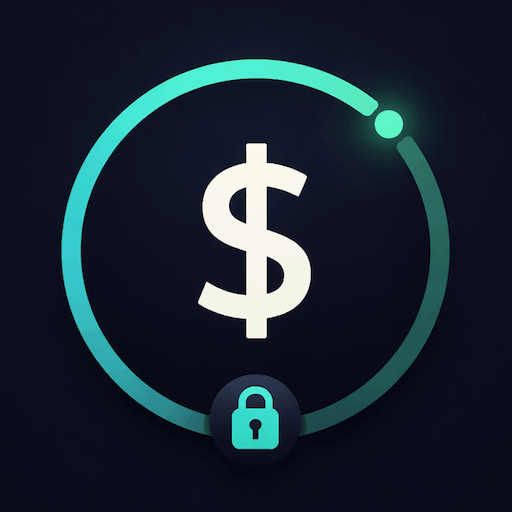
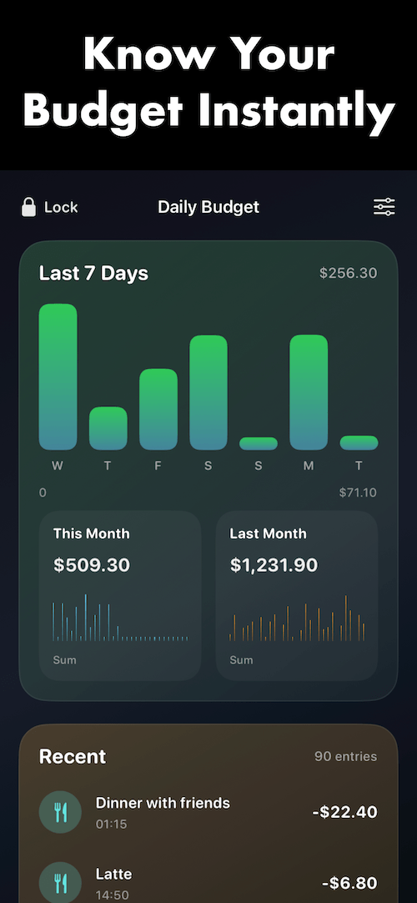
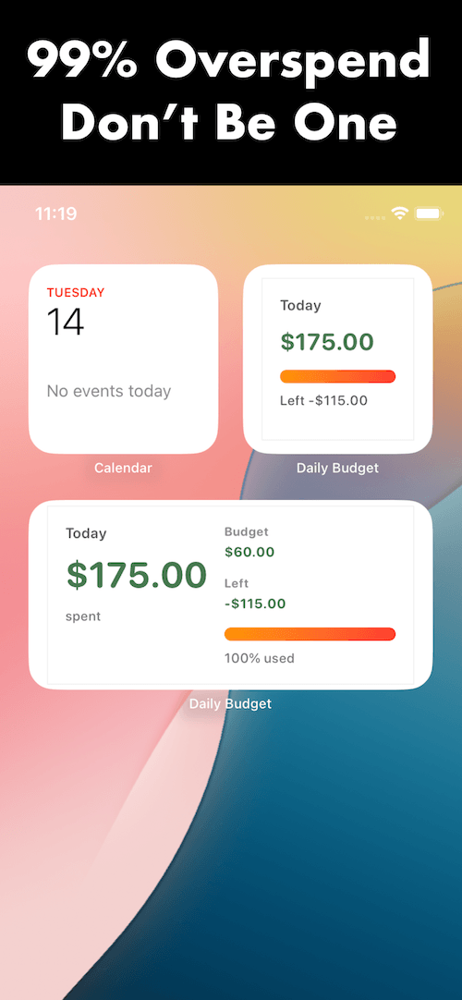
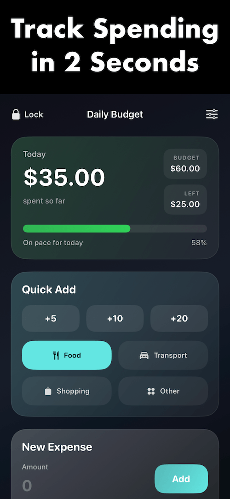

# Daily Budget – Expense Tracker

  

  <strong>Track daily spending in seconds.</strong> 
  Stay on budget with a fast, private, and beautifully simple expense tracker.

  <a href="https://apps.apple.com/vn/app/daily-budget-expense-tracker/id6762171685">
    Download on the App Store
  </a>

---

## Overview

**Daily Budget – Expense Tracker** is a simple yet powerful app designed to help you take full control of your daily spending — instantly and privately.

Track expenses in just **1–2 seconds**. See how much you’ve spent today, your daily budget, and how much remains — all at a glance.

Built for speed, clarity, and real everyday use, the app helps users manage spending without clutter, without accounts, and without sending personal data to the cloud.

---

## App Preview

  
  
  

---

## Features

### Fast & Effortless Tracking

Log expenses instantly with quick-add amounts, or enter full details with category and optional notes.

- Add expenses in **1–2 seconds**
- Quick-add amounts for faster daily logging
- Optional notes for better context
- Built for real, repeated everyday use

### Clear Budget Overview

Stay in control with live budget information, visible the moment you open the app.

- **Spent Today**
- **Daily Budget**
- **Remaining Balance**

No manual calculation. No complicated setup. Just clear numbers that help users make better decisions faster.

### Simple & Smart Organization

Organize spending with a clean structure that stays easy to use.

- 4 simple categories:
  - Food
  - Transport
  - Shopping
  - Other
- Recent transactions shown in reverse chronological order
- Delete incorrect entries with confirmation

### Visual Insights

Understand spending habits with simple charts that are easy to read.

- **7-day spending chart**
- **This Month** mini chart
- **Last Month** mini chart
- Total spending comparison

These visual summaries help users quickly spot trends and spending patterns.

### Smart Reminders

Stay aware before spending gets out of control.

- Notification at **80% of daily budget**
- Notification when budget is exceeded

### Privacy First

Your financial data stays private.

- No account required
- No cloud sync
- No tracking
- Everything stays on your device

### Secure Access

Add an extra layer of protection for personal budget data.

- 6-digit PIN protection
- Manual lock button
- Auto-lock options

### Built for Convenience

Useful features that make the app more practical in daily life.

- Home screen widgets for quick budget overview
- Multiple currency support
- USD as default currency
- Available in:
  - English
  - Spanish
  - Simplified Chinese

---

## Why Daily Budget

Daily Budget – Expense Tracker is built for users who want a lightweight, focused, and private budgeting tool.

It avoids unnecessary complexity and gives users exactly what they need:

- Fast expense logging
- Instant budget visibility
- Clean charts
- Smart reminders
- Strong privacy

This is not a bloated finance app. It is a practical daily spending companion designed to be opened often and used instantly.

---

## Privacy

**Your data stays on your device.**  
No cloud. No tracking. No account. Ever.

Daily Budget is designed with a privacy-first approach so users can track personal finances without worrying about external data collection.

---

## App Store

Download the app here:

**[Daily Budget – Expense Tracker on the App Store](https://apps.apple.com/vn/app/daily-budget-expense-tracker/id6762171685)**

---

## Assets Used in This Repo

- `logo.png` — app logo
- `anh1.png` — screenshot 1
- `anh2.png` — screenshot 2
- `anh3.png` — screenshot 3

---

## Summary

**Daily Budget – Expense Tracker** helps users:

- Log expenses quickly
- Stay within budget
- View spending trends
- Protect their data
- Keep everything simple

A fast, private, and user-friendly expense tracker for everyday life.
